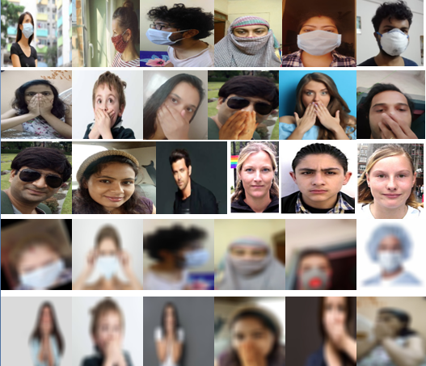
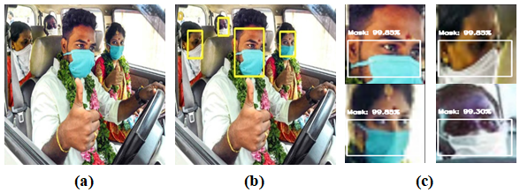

# Mask Surveillance
This data set contains mainly 
1. Masked face images
2. Non-masked face images
3. Inside vehicle masked and non-masked faces of passengers.

# Special Attention
This data set specially takes care the below use cases
1. Low resolution images
2. Side-face images
3. Hand-covered faces
4. Tiny face images
5. Inside vehicle use cases
6. Night Mode hazy images
7. Mirror reflected images

# Sample images

# On-road surveillance image sample

## Samples videos of on-rad mask detection
 [sample_1](https://github.com/srimantacse/MaskSurveillance/videos/sample_1.mp4)

# Citation
Please refer the below paper while using the data set.
>> Will be updted shortly
<!-- + https://github.com/prajnasb/observations/tree/master/experiements/data + -->